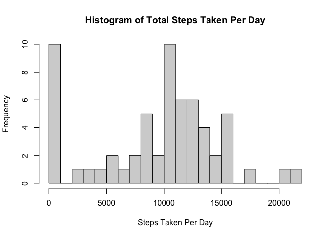
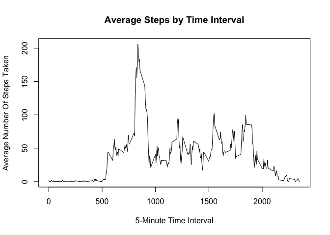
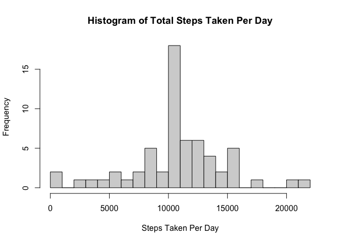
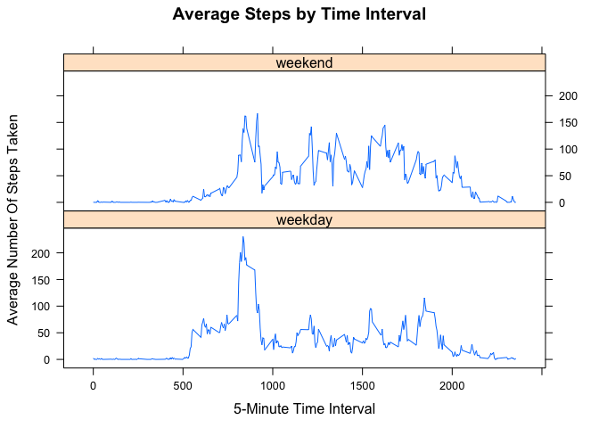

## Loading and preprocessing the data

1. Load the data from zip file and explore the summary.

```r
unzip(zipfile = "activity.zip")
repdata <- read.csv("activity.csv")
str(repdata)
```

```
## 'data.frame':	17568 obs. of  3 variables:
##  $ steps   : int  NA NA NA NA NA NA NA NA NA NA ...
##  $ date    : chr  "2012-10-01" "2012-10-01" "2012-10-01" "2012-10-01" ...
##  $ interval: int  0 5 10 15 20 25 30 35 40 45 ...
```

```r
head(repdata)
```

```
##   steps       date interval
## 1    NA 2012-10-01        0
## 2    NA 2012-10-01        5
## 3    NA 2012-10-01       10
## 4    NA 2012-10-01       15
## 5    NA 2012-10-01       20
## 6    NA 2012-10-01       25
```

```r
summary(repdata)
```

```
##      steps            date              interval     
##  Min.   :  0.00   Length:17568       Min.   :   0.0  
##  1st Qu.:  0.00   Class :character   1st Qu.: 588.8  
##  Median :  0.00   Mode  :character   Median :1177.5  
##  Mean   : 37.38                      Mean   :1177.5  
##  3rd Qu.: 12.00                      3rd Qu.:1766.2  
##  Max.   :806.00                      Max.   :2355.0  
##  NA's   :2304
```

2. Convert data into data.table.

```r
library(data.table)
repdat_tbl <- as.data.table(repdata)
```

## What is mean total number of steps taken per day?

1. Calculate the total number of steps taken per day and assign to new data.table.

```r
repdat_sum <- repdat_tbl[, list(tot_steps = sum(steps, na.rm = T)), by = date]
head(repdat_sum)
```

```
##          date tot_steps
## 1: 2012-10-01         0
## 2: 2012-10-02       126
## 3: 2012-10-03     11352
## 4: 2012-10-04     12116
## 5: 2012-10-05     13294
## 6: 2012-10-06     15420
```

2. Plotting a Histogram of the total steps taken per day

```r
hist(repdat_sum$tot_steps, breaks = 20, xlab = "Steps Taken Per Day", main = "Histogram of Total Steps Taken Per Day" )
```

<!-- -->

3. Calculating the mean and median.

```r
meanstep <- round(mean(repdat_sum$tot_steps), 2)
medstep <- median(repdat_sum$tot_steps)
```
The mean and median of the total number of steps taken per day are 9354.23 and 10395 respectively.

## What is the average daily activity pattern?
1. Make a time series plot (i.e. type = "l") of the 5-minute interval (x-axis) and the average number of steps taken, averaged across all days (y-axis).

```r
#Create a table of the average steps taken and the intervals.
repdat_avg <- aggregate(x = list(avg_steps = repdata$steps), by = list(interval = repdata$interval),
                      FUN = mean, na.rm = T)
with(repdat_avg, {
    plot( interval, avg_steps, type = "l",
          main = "Average Steps by Time Interval",
          xlab = "5-Minute Time Interval",
          ylab = "Average Number Of Steps Taken")
    })
```

<!-- -->

2. Find the 5-min interval with maximum number of steps.

```r
repdat_avg[which.max(repdat_avg$avg_steps),]
```

```
##     interval avg_steps
## 104      835  206.1698
```

## Imputing missing values
1. Calculate and report the total number of missing values in the dataset (i.e. the total number of rows with NAs)

```r
missingval <- sum(is.na(repdata$steps))
```
Number of rows with missing values is 2304.


2. Devise a strategy for filling in all of the missing values in the dataset. The strategy does not need to be sophisticated. For example, you could use the mean/median for that day, or the mean for that 5-minute interval, etc.

Strategy adopted: Fill in the missing values with the mean for the 5-minute interval.

```r
#Set interval column as key to both tables 
repdat_avg <- as.data.table(repdat_avg)
setkey(repdat_avg, interval)
setkey(repdat_tbl, interval)

#Create function to replace values
replaceNA <- function(x, y) {
    if (is.na(x)) {
        return(y)
    }
    return(x)
}
```


3. Create a new dataset that is equal to the original dataset but with the missing data filled in.

```r
#Create new dataset with missing data filled
repdat_new <- repdat_tbl[repdat_avg]
repdat_new$comp_steps <- mapply(replaceNA, repdat_new$steps, repdat_new$avg_steps)
head(repdat_new)
```

```
##    steps       date interval avg_steps comp_steps
## 1:    NA 2012-10-01        0  1.716981   1.716981
## 2:     0 2012-10-02        0  1.716981   0.000000
## 3:     0 2012-10-03        0  1.716981   0.000000
## 4:    47 2012-10-04        0  1.716981  47.000000
## 5:     0 2012-10-05        0  1.716981   0.000000
## 6:     0 2012-10-06        0  1.716981   0.000000
```

```r
#Create new dataset with new daily sum
repdatsum_new <- repdat_new[, list(tot_steps = sum(comp_steps, na.rm = T)), by = date]
head(repdatsum_new)
```

```
##          date tot_steps
## 1: 2012-10-01  10766.19
## 2: 2012-10-02    126.00
## 3: 2012-10-03  11352.00
## 4: 2012-10-04  12116.00
## 5: 2012-10-05  13294.00
## 6: 2012-10-06  15420.00
```


4. Make a histogram of the total number of steps taken each day and Calculate and report the mean and median total number of steps taken per day.

```r
hist(repdatsum_new$tot_steps, breaks = 20, xlab = "Steps Taken Per Day", main = "Histogram of Total Steps Taken Per Day" )
```

<!-- -->

```r
meanstep_new <- format(mean(repdatsum_new$tot_steps), digits = 2, nsmall = 2)
medstep_new <- format(median(repdatsum_new$tot_steps), digits = 2, nsmall = 2)
```

The new computed mean and median of the total number of steps taken per day are 10766.19 and 10766.19 respectively.


As expected, the new computed values differ from the previous estimates. 


The impact of imputing the missing values: The new median is closer to the new mean, as the missing values were replaced with the means of those intervals, thus, increasing the median.


## Are there differences in activity patterns between weekdays and weekends?
1. Using the new filled in dataset, create a new factor variable in the dataset with two levels – "weekday" and "weekend" indicating whether a given date is a weekday or weekend day.


```r
#add a new column, titled type_of_day
repdat_new$day_of_week <- weekdays(as.Date(repdat_new$date))

#determine if date is a weekday or weekend
part_of_week <- function(day) {
    if (day %in% c("Saturday", "Sunday")) {
        return("weekend")
    }
    return("weekday")
}

#add a column with factor to denote weekday or weekend
repdat_new$type_of_day <- as.factor(apply(as.matrix(repdat_new$day_of_week), 1, part_of_week))
head(repdat_new)
```

```
##    steps       date interval avg_steps comp_steps day_of_week type_of_day
## 1:    NA 2012-10-01        0  1.716981   1.716981      Monday     weekday
## 2:     0 2012-10-02        0  1.716981   0.000000     Tuesday     weekday
## 3:     0 2012-10-03        0  1.716981   0.000000   Wednesday     weekday
## 4:    47 2012-10-04        0  1.716981  47.000000    Thursday     weekday
## 5:     0 2012-10-05        0  1.716981   0.000000      Friday     weekday
## 6:     0 2012-10-06        0  1.716981   0.000000    Saturday     weekend
```

2. Make a panel plot containing a time series plot (i.e. type = "l") of the 5-minute interval (x-axis) and the average number of steps taken, averaged across all weekday days or weekend days (y-axis). 


```r
#Create a table of the average steps taken groupged by the intervals and type of day.
repdatsum_new <- repdat_new[, list(avg_steps = mean(comp_steps, na.rm = T)), by = list(interval, type_of_day)]

head(repdatsum_new)
```

```
##    interval type_of_day  avg_steps
## 1:        0     weekday 2.25115304
## 2:        0     weekend 0.21462264
## 3:        5     weekday 0.44528302
## 4:        5     weekend 0.04245283
## 5:       10     weekday 0.17316562
## 6:       10     weekend 0.01650943
```

```r
library(lattice)
xyplot(avg_steps ~ interval | type_of_day, data = repdatsum_new,
      type = "l",
      main = "Average Steps by Time Interval",
      xlab = "5-Minute Time Interval",
      ylab = "Average Number Of Steps Taken",
      layout = c(1,2))
```

<!-- -->

